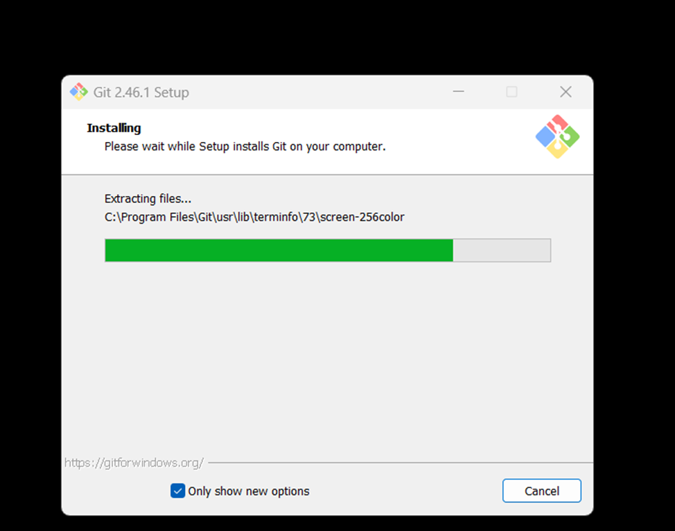

# LR6
Лабораторная работа №6

# Отчет по работе с Git

## 1. Создание форка
*Скриншот с созданием форка добавлен здесь*  


## 2. Установка Git
*Скриншот с процессом установки git*  


## 3. Изменение имени пользователя
Команда для изменения имени пользователя:

```bash
$ git config --global user.name "4317 Шпаков А.С."
```

## 4. Клонирование репозитория

```bash
$ git clone https://github.com/Antochhka/LR6
```